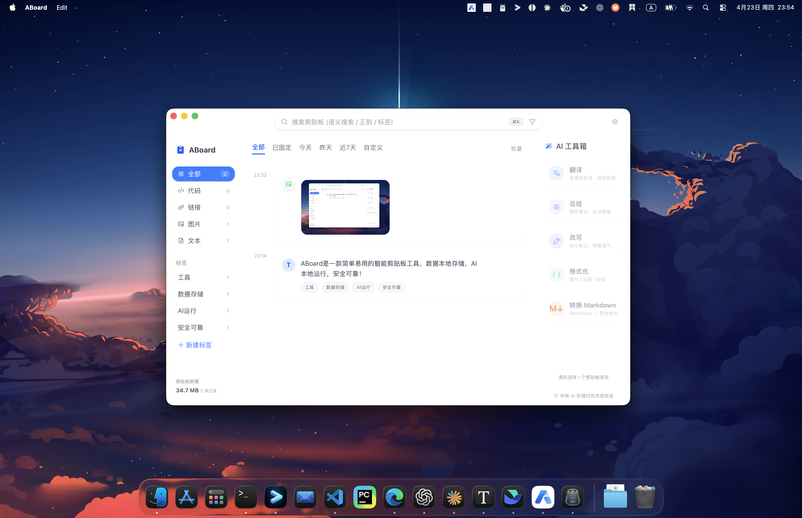

<p align="center">
  
</p>

<h1 align="center">ABoard</h1>

<p align="center">
  <strong>AI-Powered Clipboard Manager for Desktop</strong><br>
  <sub>Intelligence at Every Copy — runs locally, no cloud required</sub>
</p>

<p align="center">
  
  
  
  
</p>

<p align="center">
  <a href="docs/README.zh.md">中文</a> · <strong>English</strong>
</p>

---

## Why ABoard?

Every time you copy something, ABoard captures, categorizes, and enriches it with AI — automatically. Built for developers and power users who live in the clipboard.

- **Zero config** — works immediately, AI runs fully offline
- **Privacy first** — all processing on your machine, no data leaves your device
- **Tiny footprint** — app binary under 20MB (excl. optional AI model)

## Features

### Clipboard Management

- **Real-time capture** — monitors clipboard changes instantly with SHA256 dedup
- **Smart classification** — auto-detects code, links, JSON, XML, images, video, plain text
- **Pinned items** — star important clips to keep them at the top
- **Batch operations** — select, delete, export multiple items at once
- **Drag & drop reorder** — organize items by dragging

### AI Toolbox

- **One-click actions** — translate, summarize, rewrite, format
- **Local AI engine** — built-in Qwen2.5-0.5B via Candle GGUF inference (fully offline)
- **Extensible** — plug in Ollama, OpenAI, or Anthropic for more powerful models
- **Format tools** — JSON/XML pretty-print, HTML ↔ Markdown conversion

### Search & Navigation

- **Full-text search** — FTS5-powered instant search across all history
- **Semantic search** — AI keyword expansion for natural language queries
- **Category filters** — filter by type (code, link, image, video, text) or AI tags
- **Keyboard navigation** — arrow keys, shortcuts for every action

### Screen Capture

- **Screenshot** — interactive area selection, auto-saved to clipboard history
- **Screen recording** — record to MP4 directly from the tray menu (macOS / Windows)

## Screenshots

<p align="center">
  
</p>

## Download

Download the latest release from [GitHub Releases](https://github.com/clear2x/ABoard/releases).

### macOS

ABoard uses ad-hoc signing (not Apple-notarized). On first launch:

1. Open the `.dmg` and drag **ABoard** to Applications
2. In Finder, **right-click** ABoard → **Open**
3. Click **Open** again in the dialog

> Direct double-click will be blocked by Gatekeeper. Right-click → Open bypasses this.

### Windows

Download the installer from [Releases](https://github.com/clear2x/ABoard/releases).

## Quick Start (Development)

### Prerequisites

- [Node.js](https://nodejs.org/) >= 18
- [Rust](https://www.rust-lang.org/tools/install) >= 1.77
- Platform dependencies per [Tauri v2 prerequisites](https://v2.tauri.app/start/prerequisites/)

```bash
git clone https://github.com/clear2x/ABoard.git
cd ABoard
npm install
npm run tauri dev
```

### Production Build

```bash
npm run tauri build
```

Output in `src-tauri/target/release/bundle/`

## Keyboard Shortcuts

| Shortcut | Action |
|----------|--------|
| `⌘/Ctrl + Shift + V` | Toggle floating quick-paste popup |
| `⌘/Ctrl + Shift + J` | Cycle through history and paste |
| `⌘/Ctrl + K` | Focus search bar |
| `Delete` | Delete selected item |
| `⌘/Ctrl + P` | Pin / unpin selected item |
| `↑ / ↓` | Navigate items |
| `Esc` | Exit batch mode |

## AI Configuration

ABoard ships with a built-in AI engine. No setup required for basic features.

| Provider | Type | Setup |
|----------|------|-------|
| **Built-in** (Candle) | Embedded | Auto-downloads Qwen2.5-0.5B GGUF (~400MB) on first use |
| [Ollama](https://ollama.com) | Local | Install, pull a model, click "Detect" in settings |
| [OpenAI](https://openai.com) | Cloud | API Key + Endpoint |
| [Anthropic](https://anthropic.com) | Cloud | API Key |

Configure in **Settings → AI**.

## Tech Stack

| Layer | Technology |
|-------|-----------|
| Framework | [Tauri v2](https://v2.tauri.app/) — Rust + WebView |
| Frontend | [SolidJS](https://www.solidjs.com/) + [Tailwind CSS v4](https://tailwindcss.com/) |
| Database | [SQLite](https://www.sqlite.org/) via [rusqlite](https://github.com/rusqlite/rusqlite) |
| Search | [FTS5](https://www.sqlite.org/fts5.html) full-text + semantic expansion |
| AI (embedded) | [Candle](https://github.com/huggingface/candle) GGUF inference |
| AI (local) | [Ollama](https://ollama.com) / [llama.cpp](https://github.com/ggerganov/llama.cpp) |
| Icons | [Phosphor Icons](https://phosphoricons.com/) |

## Project Structure

```
ABoard/
├── src/                    # SolidJS frontend
│   ├── components/         # UI components
│   ├── stores/             # Reactive state (SolidJS signals)
│   └── styles/             # CSS & design tokens
├── src-tauri/              # Rust backend
│   ├── src/
│   │   ├── ai/             # AI providers (cloud, local, embedded)
│   │   ├── clipboard.rs    # Clipboard monitor
│   │   ├── db.rs           # SQLite storage & FTS5
│   │   ├── tray.rs         # System tray & menus
│   │   └── lib.rs          # App entry & command registration
│   ├── icons/              # App icons (all platforms)
│   └── tauri.conf.json     # Tauri configuration
├── .github/workflows/      # CI/CD — build & release
└── docs/                   # Screenshots, Chinese README
```

## Contributing

Issues and pull requests are welcome! Please open an issue first to discuss what you'd like to change.

## License

[MIT](LICENSE)
